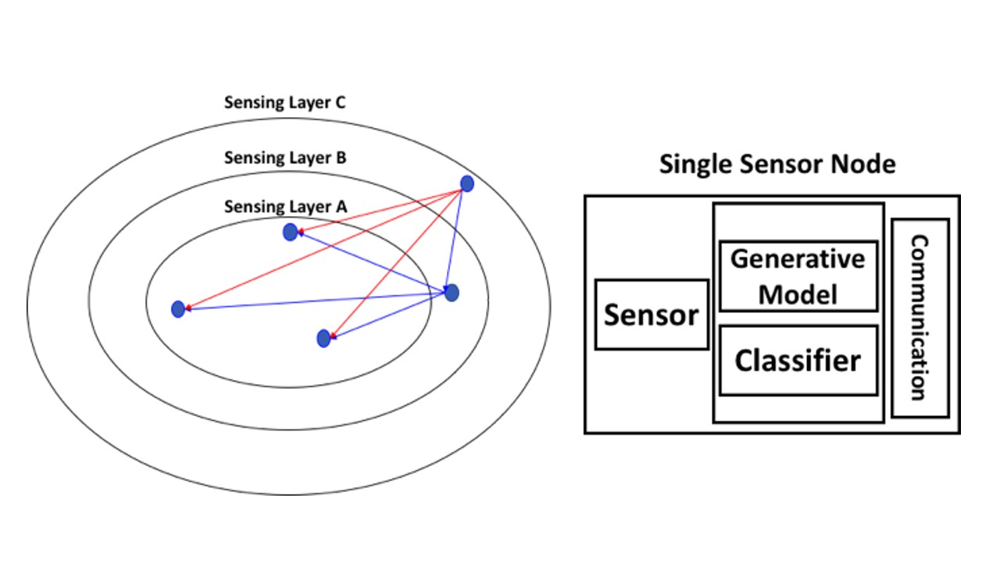
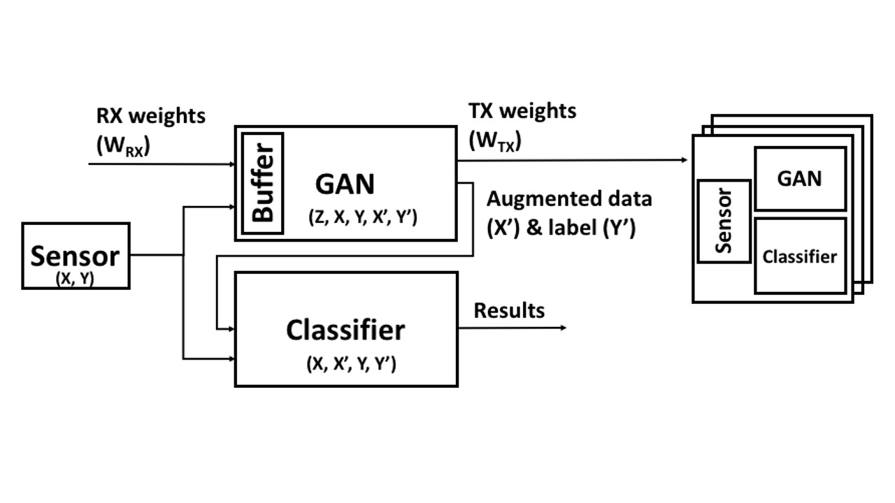
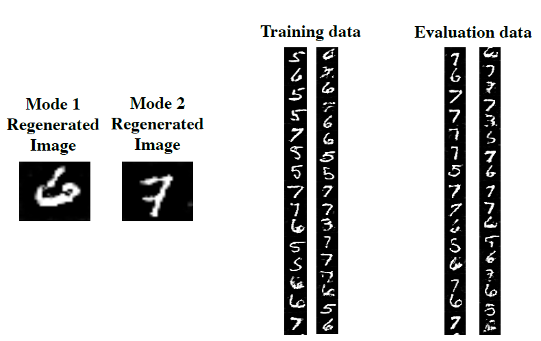
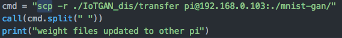
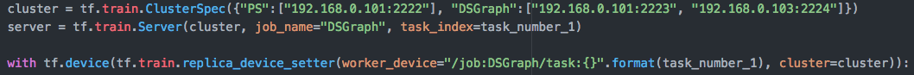

# IoTGAN
> This project proposes an on-device generative adversarial network (GAN) where each Internet of things (IoT) device pre-trains and shares its GAN weight vector over an ad-hoc local network.

Since in the on-device machine learning, the training data used by the model will be limited in terms of amount of data and mode coverage. In the IoT network, wider data coverage can be obtained through the broadcast data to sensor nodes in the network, so that the trained mode coverage, training accuracy and energy efficiency can be optimized. Since IoT devices often use personal sensing data, direct share raw data will involve security risk. In this paper we propose IoTGAN framework that shares weight vectors provided from the neighboring sensor nodes in the network.

Above photo shows proposed IoT GAN Model. The model contains sensor data, GAN model and a classifier in a single node. Sensor data X and label Y can be used for training classifier directly. In order to train sharable weight vectors in the IoT network, an embedded buffer of GAN model uses received weight vector (WRX) to generate fake image and shuffling with sensor data for the further GAN training. After training, the GAN model transfer weight vectors (WTX) wirelessly to external nodes in the network. The GAN generated augmented dataset (X’, Y’) has been used to train classifier for extended mode coverage of classification.

## Running the codes
GAN weight training:
To train a GAN for digit 0-9: 
./*main.py --train-digits 0,1,2,3,4,5,6,7,8,9. Models and sample generated images will be saved to ./output.

Classifier training by using generated weight files and also test the accuracy:
To train mnist on GAN generated models which are sitting in ./output: 
./main.py --train-mnist. After training calssifier, the output will be a % of accuracy testing result.

## Usage example
For quick testing the idea of weight vector shared network, we use MNIST as our sensing dataset. We split MNIST digits into many cluster nodes. In the each node it contains single digit as local data. By collecting recived weight vector and regenerating the images, the amount of modes of training dataset can be extended. These images show extended training dataset, and generated image output after GAN training. 

code example:

After GAN training, we can use scp for transmiting trained weight vector.

## Development setup

To make this experiment, we use multiple Raspberry Pis as cluster nodes in the IoT Network. You have to install tensorflow on all the cluster nodes. You also have to specify the task number for each node.

## Meta

PoHung Kuo – [@Linkedin](https://www.linkedin.com/in/pohung-kuo-363446175/) – phkuo@stanford.edu
Distributed under the license. See ``LICENSE`` for more information.

[https://github.com/Pohungkuo/IoTGAN](https://github.com/Pohungkuo/IoTGAN)

## Resources
https://github.com/gtoubassi/mnist-gan GAN Model for MNIST dataset.

https://www.tensorflow.org/deploy/distributed Distributed Tensorflow tutorial.
